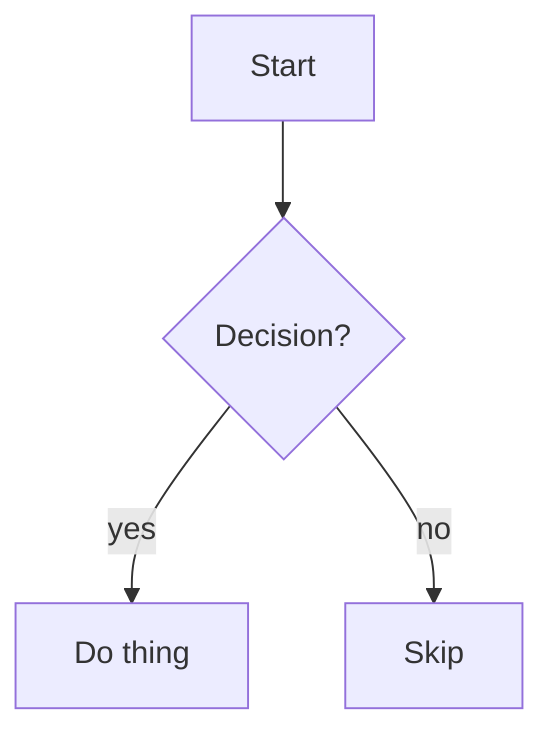

# Mermaid diagrams in Markdown

Mermaid is text-defined diagrams rendered inline by GitHub, GitLab, VS Code, Obsidian, and most Markdown viewers. A diagram is a fenced code block tagged `mermaid`:

````

````

Flowcharts are the default ask. For anything else, see `references/diagrams.md`.

## Workflow

1. **Clarify the shape, not the syntax.** Work out the nodes, the connections, and the direction of flow from context or the user. Don't ask about Mermaid syntax — that's this skill's job.
2. **Pick a direction.** `TD`/`TB` (top-down) for hierarchies and decision trees; `LR` (left-right) for pipelines and sequential processes.
3. **Write the block** following `references/flowchart.md`. Quote any label with special characters (see gotchas below).
4. **Place it** in the target Markdown file where the surrounding prose refers to it. Insert with the Edit tool; don't rewrite the whole file.
5. **Validate** before claiming it works — see Validation. Broken Mermaid renders as a red error box, not a diagram.

## Flowchart essentials

| Want               | Syntax                   |
| ------------------ | ------------------------ |
| Node (box)         | `A[Label]`               |
| Rounded            | `A(Label)`               |
| Decision (diamond) | `A{Label}`               |
| Circle / start-end | `A((Label))`             |
| Arrow              | `A --> B`                |
| Labeled arrow      | `A -->\|yes\| B`         |
| Dotted             | `A -.-> B`               |
| Thick              | `A ==> B`                |
| Subgraph           | `subgraph Title` … `end` |

Full node shapes, edge types, styling, and links: `references/flowchart.md`.

## Gotchas (the stuff that breaks rendering)

- **Special characters in labels** (`()`, `[]`, `{}`, `:`, `#`, `"`, `/`, `-`) → wrap the label in quotes: `A["fetch(url): result"]`. This is the #1 cause of broken diagrams.
- **`<br>` for line breaks** inside labels, not `\n`.
- **No spaces in node IDs** — `node1`, not `node 1`. Spaces go in the `[label]`, not the ID.
- **The fence must be exactly ` ```mermaid `** — no extra text on that line, or GitHub treats it as plain code.
- **GitHub-specific quirks** (no click events, theme handling, size limits) and other escaping rules: `references/gotchas.md`.

## Validation

No global tooling required — validate via `npx` (downloads on first run, then cached):

```bash
scripts/validate.sh path/to/file.md      # extracts every mermaid block and parses each
scripts/validate.sh -                     # read a single diagram from stdin
```

It uses `@mermaid-js/mermaid-cli` to parse-only (no image output). A non-zero exit means at least one block is invalid; the error names the offending line.

## References

- **`references/flowchart.md`** — complete flowchart syntax: all node shapes, edge styles, subgraphs, styling/classes, clickable links.
- **`references/diagrams.md`** — other diagram types: sequence, class, state, ER, gantt, pie, mindmap, gitGraph, timeline — with a minimal template for each.
- **`references/gotchas.md`** — escaping rules, GitHub vs other renderers, accessibility, common error messages and their fixes.
