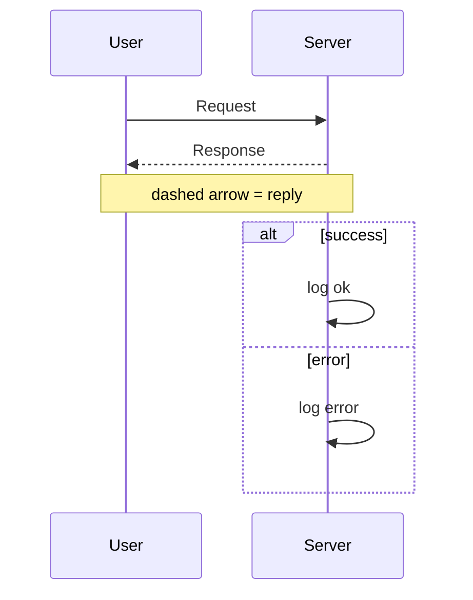
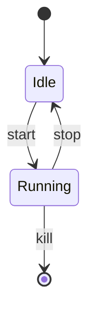
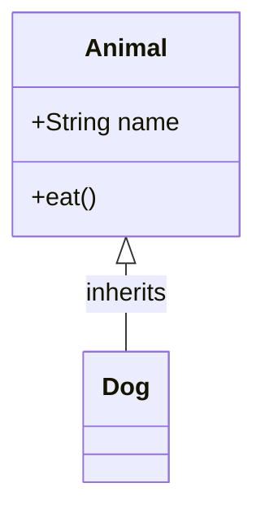
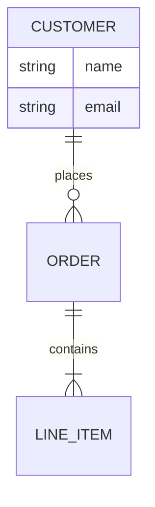
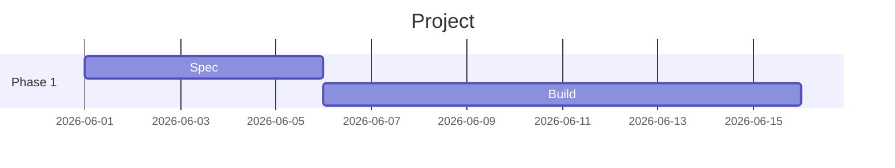
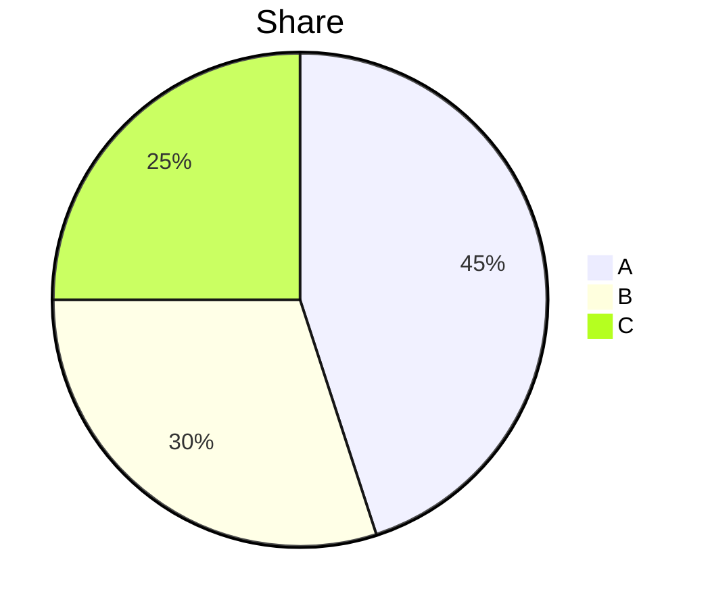
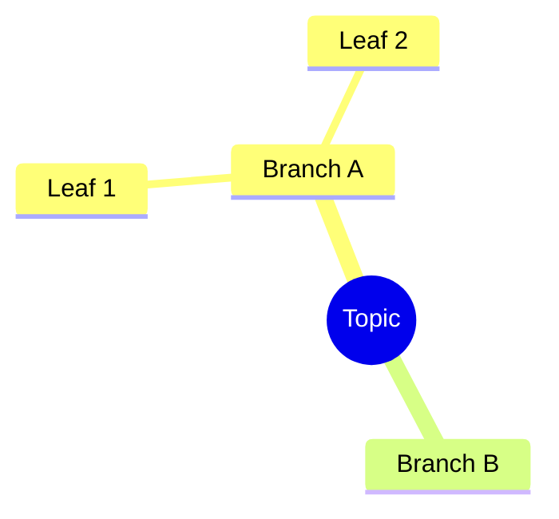
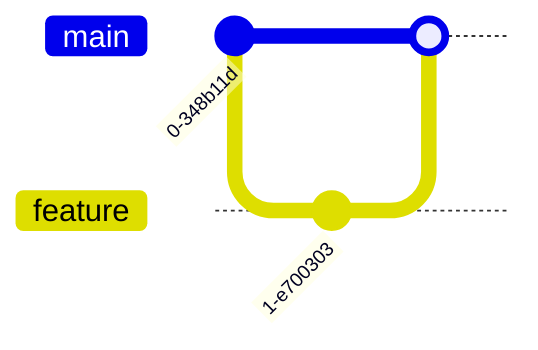
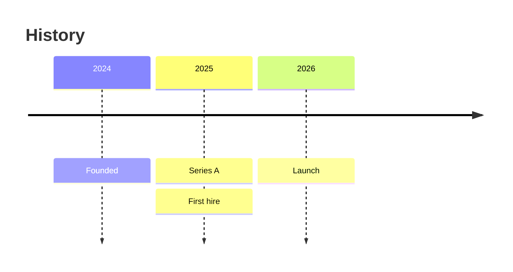
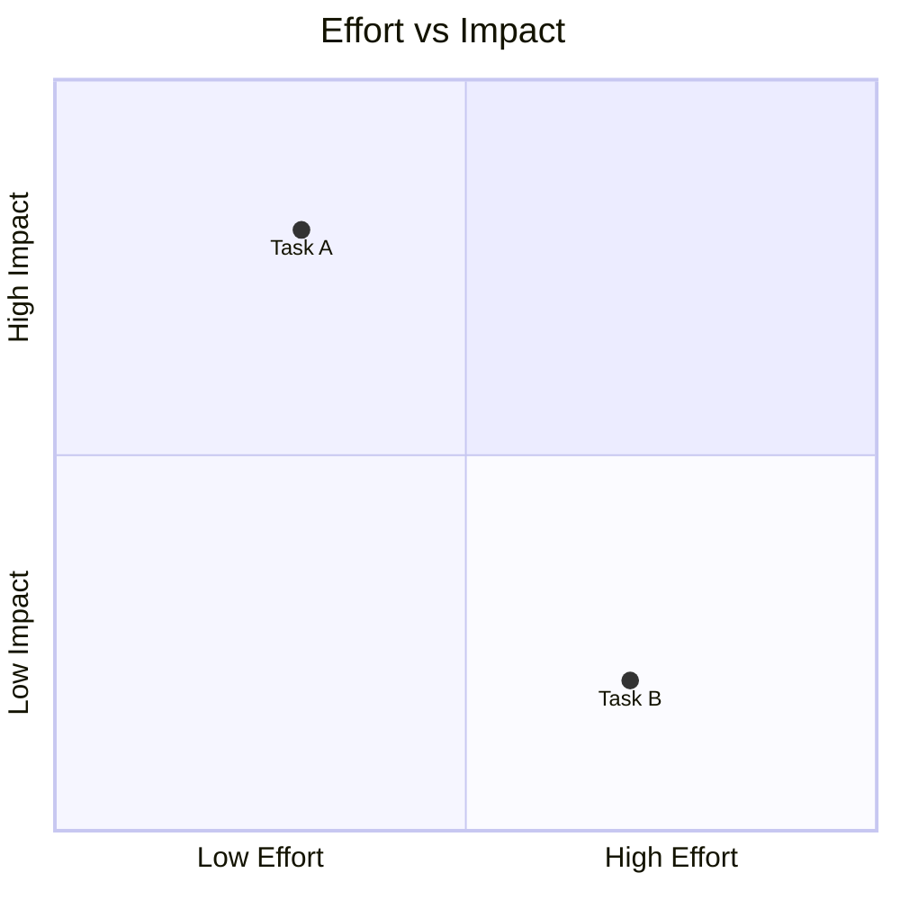

# Other diagram types

Minimal, copy-paste templates. Each goes in a ```mermaid fenced block. Full docs: https://mermaid.js.org

## Sequence diagram

Interactions over time between participants.



Arrows: `->>` solid, `-->>` dashed reply, `-x` lost message, `->>+`/`->>-` activate/deactivate.

## State diagram

State machines.



## Class diagram



Relations: `<|--` inheritance, `*--` composition, `o--` aggregation, `-->` association, `..>` dependency.

## Entity relationship



Cardinality: `||` one, `o{` zero-or-many, `|{` one-or-many.

## Gantt



## Pie



## Mindmap



## Git graph



## Timeline



## Quadrant chart


