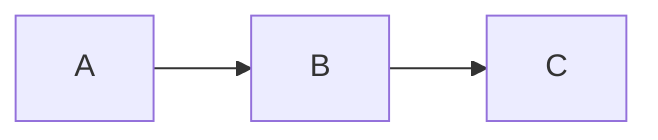
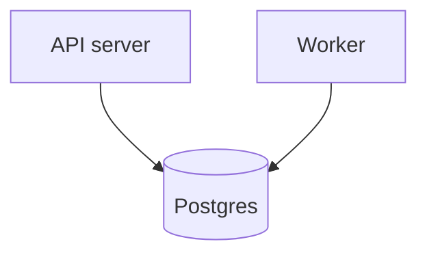
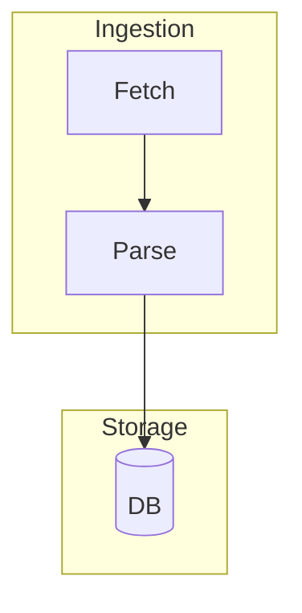
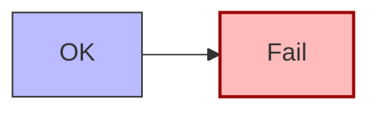
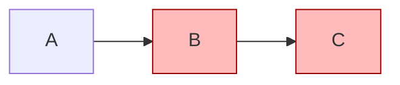

# Flowchart syntax (complete reference)

A flowchart starts with `flowchart <DIR>` (or the older `graph <DIR>`). Prefer `flowchart`.

## Direction

| Code         | Direction    |
| ------------ | ------------ |
| `TD` or `TB` | top → bottom |
| `BT`         | bottom → top |
| `LR`         | left → right |
| `RL`         | right → left |

## Node shapes

| Syntax         | Shape               |
| -------------- | ------------------- |
| `id[Text]`     | rectangle           |
| `id(Text)`     | rounded rectangle   |
| `id([Text])`   | stadium / pill      |
| `id[[Text]]`   | subroutine          |
| `id[(Text)]`   | cylinder / database |
| `id((Text))`   | circle              |
| `id{Text}`     | rhombus / decision  |
| `id{{Text}}`   | hexagon             |
| `id[/Text/]`   | parallelogram       |
| `id[\Text\]`   | parallelogram alt   |
| `id[/Text\]`   | trapezoid           |
| `id>Text]`     | asymmetric / flag   |
| `id(((Text)))` | double circle       |

A node ID is declared once with a shape; reuse the bare ID afterward:

## Edges

| Syntax             | Edge                    |
| ------------------ | ----------------------- | --- | ---------------- |
| `A --> B`          | arrow                   |
| `A --- B`          | open line               |
| `A -->             | label                   | B`  | arrow with label |
| `A -- label --- B` | line with label         |
| `A -.-> B`         | dotted arrow            |
| `A -.label.-> B`   | dotted, labeled         |
| `A ==> B`          | thick arrow             |
| `A ==label==> B`   | thick, labeled          |
| `A ~~~ B`          | invisible (layout hint) |
| `A --o B`          | circle endpoint         |
| `A --x B`          | cross endpoint          |
| `A <--> B`         | bidirectional           |

Chain edges: `A --> B --> C`. Branch from one node: `A --> B & C` (to both), `A & B --> C` (from both).

Longer arrows push nodes further apart / down a rank — add dashes: `A ---> B`, `A ----> B`.

## Subgraphs

Set a subgraph's internal direction with `direction LR` on its own line inside the block.

## Styling

Inline single node:

Reusable classes:

Shorthand to assign a class at declaration: `A:::warn`.

## Clickable links (not on GitHub — see gotchas)

## Comments

Lines starting with `%%` are ignored:

