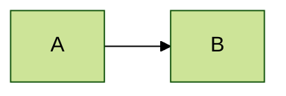
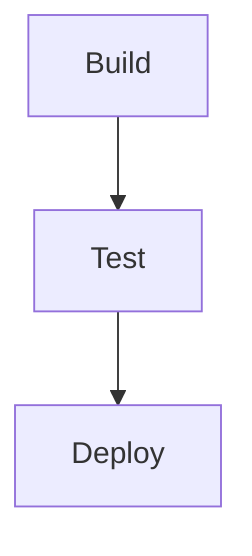

# Gotchas, escaping, and renderer quirks

## Escaping label text

The parser chokes on unquoted special characters. **When in doubt, quote the label.**

| Problem                           | Fix                                                    |
| --------------------------------- | ------------------------------------------------------ |
| Parens/brackets/braces in a label | quote it: `A["calc(x)"]`                               |
| Colon, semicolon, `#`             | quote it: `A["step: parse"]`                           |
| Literal quote inside a label      | use HTML entity: `A["say #quot;hi#quot;"]` or `&quot;` |
| Line break                        | `A["line one<br>line two"]` (HTML `<br>`, never `\n`)  |
| `<`, `>` as text                  | `&lt;` / `&gt;`                                        |
| `%` as text                       | `#37;`                                                 |

Node IDs must be alphanumeric/underscore, no spaces, not a reserved word (`end`, `graph`, `subgraph`, `class`, `click`, etc.). If you need a node literally called "end", capitalize or wrap: `End[end]`.

## GitHub vs. other renderers

GitHub renders Mermaid in Markdown natively but with a locked-down config:

- **No `click` events / interactions** — links and callbacks are stripped for security. They work in VS Code/Obsidian/mermaid.live but not on github.com.
- **No custom themes via `%%{init}%%`** beyond what GitHub allows; some directives are ignored.
- **Size cap** — very large diagrams may be truncated or refuse to render. Split into multiple diagrams or use subgraphs.
- The opening fence must be exactly ` ```mermaid ` on its own line. Trailing spaces or text break detection.

Renderer support varies:

| Feature              | GitHub  | VS Code                | Obsidian | mermaid.live |
| -------------------- | ------- | ---------------------- | -------- | ------------ |
| Core diagrams        | ✅      | ✅                     | ✅       | ✅           |
| `click` events       | ❌      | ✅                     | partial  | ✅           |
| `%%{init}%%` themes  | partial | ✅                     | ✅       | ✅           |
| Newest diagram types | lags    | depends on ext version | lags     | ✅ latest    |

When unsure whether a feature renders for the user's target, prefer the conservative subset that works on GitHub.

## Theming (where supported)

A front-matter or init directive at the top of the block:



Built-in themes: `default`, `neutral`, `dark`, `forest`, `base`. With `base` you can override `themeVariables`.

## Accessibility

Add a title and description so screen readers and previews have context:



## Common errors and what they mean

| Error message                             | Likely cause                                                                  |
| ----------------------------------------- | ----------------------------------------------------------------------------- |
| `Parse error on line N ... Expecting ...` | unquoted special char in a label, or a typo'd arrow (`->` instead of `-->`)   |
| `got 'PS'` / `got 'SQS'`                  | bracket/paren shape mismatch — an opener without its matching closer          |
| Diagram renders blank                     | wrong/missing diagram-type keyword on line 1 (e.g. `flowchart` misspelled)    |
| Whole block shows as plain code           | the fence isn't exactly ` ```mermaid `, or the viewer doesn't support Mermaid |
| `Maximum text size ... exceeded`          | diagram too large for the renderer's cap — split it                           |
| Reserved-word error on a node named `end` | rename/capitalize the ID                                                      |

## Quick self-check before shipping a diagram

1. Line 1 is a valid diagram-type keyword.
2. Every label with a special char is quoted.
3. Every shape opener has its matching closer.
4. Node IDs have no spaces and aren't reserved words.
5. If targeting GitHub: no `click` events relied upon.
6. Run `scripts/validate.sh` if any doubt remains.
